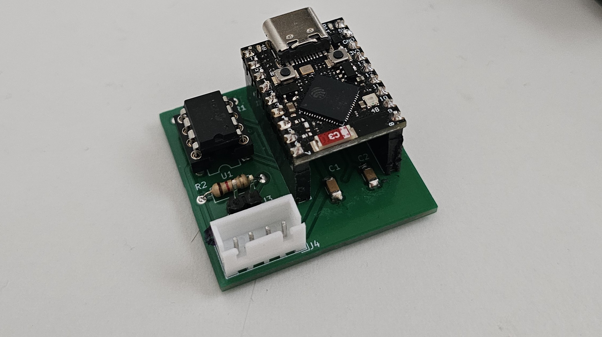

# OBD-BLE Adapter

An ESP32-S3 firmware that turns a bare CAN transceiver into a Bluetooth Low Energy OBD-II adapter.
The device talks ISO 15765-4 (OBD-II over CAN) to the vehicle and exposes the responses over a
single BLE GATT characteristic, so a phone app can subscribe and receive live engine data.

The companion phone application that reads and displays the data is a separate project.



---

## Features

- **BLE peripheral** built on the Apache NimBLE stack shipped with ESP-IDF — advertises as `OBD`,
  one custom service with one write/notify characteristic.
- **OBD-II request scheduler** with per-PID polling periods, retry logic, and automatic back-off
  when the bus stops answering.
- **ISO-TP (ISO 15765-2) reassembly** — single frames, and multi-frame responses via
  First Frame / Flow Control / Consecutive Frame, so VIN and DTC lists come back intact.
- **Correct request pacing** — P2 / P2\* timeout supervision, `N_Cr` supervision for multi-frame
  transfers, and a hard minimum gap between requests so a chatty BLE client cannot flood the CAN bus.
- **Queue-based message bus** decoupling the BLE and CAN subsystems; either side can post and
  consume asynchronously, and the CAN RX ISR posts straight into the OBD task's queue.
- **Hardware CAN filtering** — the TWAI controller only accepts the OBD response range, so the CPU
  never sees the rest of the vehicle's traffic.
- **CI** — every push to `main` builds the project against ESP-IDF v5.5.1 for `esp32s3`.

---

## Hardware

| Item | Requirement |
| --- | --- |
| MCU | BLE-capable ESP32 with a TWAI controller — **ESP32-S3 is the tested target** |
| Transceiver | Any 5 V/3.3 V CAN transceiver (SN65HVD230, TJA1050, MCP2551, …) |
| Bus | 11-bit CAN, **500 kbit/s** |

Default pin assignment (`main/main.c`):

| Signal | GPIO |
| --- | --- |
| CAN TX (to transceiver) | `5` |
| CAN RX (from transceiver) | `4` |
| WS2812 status LED | `48` |

Change the `IO_TX`, `IO_RX` and `WS2812_GPIO` defines at the top of `main/main.c` to match your board.

---

## Architecture

The application runs as a set of FreeRTOS tasks that never call each other directly — they exchange
`app_msg_t` messages through two FreeRTOS queues (the "mailboxes").

```
                 write (cmd, pid)              post
   Phone  ──BLE──►  GATT server  ──────────►  obd mailbox  ──┐
                                                             │
                    CAN RX ISR   ──────────►  obd mailbox  ──┤
                                                             ▼
                                                     ┌───────────────┐
                                                     │   OBD task    │  scheduler, ISO-TP,
                                                     │ (obd_diag.c)  │  timeouts, retries
                                                     └───────┬───────┘
                                                             │ can_send()
                                                             ▼
                                                        TWAI driver ──► vehicle
                                                             │
   Phone  ◄──notify── BLE TX task ◄── ble mailbox ◄──────────┘
```

| Component | File | Responsibility |
| --- | --- | --- |
| Entry point | `main/main.c` | NVS init, mailbox init, CAN init, BLE bring-up, task creation |
| BLE stack | `main/src/ble_stack.c` | NimBLE host init, host task, reset/sync callbacks |
| GAP | `main/src/gap.c` | Advertising, connection and subscription events, connection-parameter updates |
| GATT server | `main/src/gatt.c` | OBD service/characteristic, RX callback registration |
| BLE tasks | `main/src/ble_tasks.c` | Drains the BLE mailbox and sends notifications; maps writes to commands |
| CAN | `main/src/can_tasks.c` | TWAI node setup, hardware mask filter, RX ISR callback, `can_send()` |
| OBD logic | `main/src/obd_diag.c` | Request scheduling, ISO-TP, negative responses, timeout supervision |
| Message bus | `main/src/message_bus.c` | Two `xQueue`-backed mailboxes, ISR-safe post |
| Status LED | `main/src/ws2812.c` | Bit-banged WS2812 driver over the RMT peripheral **(NOT USED ATM)** |

Tasks created at startup:

| Task | Stack | Priority |
| --- | --- | --- |
| `NimBLE Host` | 4 KB | 5 |
| `BLE TX task` | 4 KB | 5 |
| `OBD task` | 4 KB | 3 |

---

## BLE interface

**Device name:** `OBD` · **Advertising interval:** ~500 ms · connectable, general discoverable.

| | UUID |
| --- | --- |
| Service | `12345678-90ab-cdef-fedc-ba0987654321` |
| Characteristic | `21436587-09ba-dcfe-efcd-ab9078563412` |

The characteristic supports **Write**, **Write Without Response** and **Notify**. A client writes a
command, subscribes to notifications, and receives the OBD responses as they arrive.

### Commands (client → device)

The write payload is at most 8 bytes; `data[0]` is the command, `data[1]` is the PID where relevant.

| Byte 0 | Name | Meaning |
| --- | --- | --- |
| `0x00` | `STOP_CMD` | Stop polling, go idle |
| `0x01` | `START_CMD` | Start streaming the configured PID set |
| `0x02` | `SUPP_PID_CMD` | Sweep the "supported PIDs" blocks (`0x00, 0x20, 0x40, 0x60, 0x80, 0xA0`) once |
| `0x03` | `DTC_CMD` | Read stored diagnostic trouble codes (service `0x03`) |
| `0x10` | `PID_CMD` | One-shot read of the mode-01 PID in `data[1]` |
| `0x11` | `VIN_CMD` | Read the VIN (service `0x09`, PID `0x02`) |

Disconnecting implicitly issues `STOP_CMD`, so the adapter stops driving the bus when the phone goes away.

### Notifications (device → client)

Completed OBD responses are forwarded **raw**, in ≤ 8-byte chunks — the ISO-TP framing is already
stripped, so what is received is the service response starting with the response service ID
(`0x41` for mode 01, `0x43` for DTCs, `0x49` for VIN), followed by the echoed PID and the data bytes.
Multi-frame payloads arrive as several consecutive notifications. Scaling raw values into engineering
units is the phone app's job.

---

## OBD / CAN behaviour

**Addressing (ISO 15765-4, 11-bit):** requests go out functionally on `0x7DF`; responses are accepted
from `0x7E8`–`0x7EF`. The TWAI hardware filter is configured, so
everything else on the bus is dropped before it reaches software.

**Streamed PIDs** and their polling periods:

| PID | Meaning | Period |
| --- | --- | --- |
| `0x0C` | Engine RPM | 50 ms |
| `0x04` | Calculated engine load | 50 ms |
| `0x0D` | Vehicle speed | 100 ms |
| `0x05` | Coolant temperature | 2500 ms |
| `0x2F` | Fuel level | 2500 ms |

The scheduler picks whichever PID is furthest past its due time, so a slow bus degrades gracefully
instead of starving the low-priority PIDs.

**Timing constants:**

| Constant | Value | Purpose |
| --- | --- | --- |
| `OBD_P2_TIMEOUT_MS` | 100 ms | Response timeout (P2\_CAN is 50 ms; the rest is margin) |
| `OBD_P2_STAR_TIMEOUT_MS` | 5000 ms | Extended window after NRC `0x78` (responsePending) |
| `OBD_N_CR_TIMEOUT_MS` | 150 ms | Max gap between consecutive frames |
| `OBD_MIN_POLL_GAP_MS` | 50 ms | Hard floor between two requests |
| `OBD_IDLE_BACKOFF_MS` | 1000 ms | Poll gap once the bus looks dead |
| `OBD_MAX_RETRIES` | 2 | Retries before skipping a PID |
| `ISOTP_MAX_PAYLOAD` | 128 B | Reassembly buffer size |

Every request is funnelled through a single `obd_start_request()`, and two gates guard it: no
transaction may be outstanding, and at least `OBD_MIN_POLL_GAP_MS` must have passed since the last frame the
adapter put on the bus. Negative response code `0x78` extends the deadline rather than triggering a
resend. After roughly two full sweeps with no answer the adapter backs off to one request per second.

---

## Building and flashing

Requires an installed **ESP-IDF** environment (CI uses **v5.5.1**).

```bash
idf.py set-target esp32s3
idf.py build
idf.py flash monitor
```

A dev container is included (`.devcontainer/`) based on the `espressif/idf` image with QEMU added,
so the project can be opened directly in VS Code Dev Containers or GitHub Codespaces without a local
toolchain install.

---

## Repository layout

```
├── main/
│   ├── main.c              # app_main: init and task creation
│   ├── include/            # public headers, protocol constants, message types
│   └── src/                # ble_stack, gap, gatt, ble_tasks, can_tasks, obd_diag, message_bus, ws2812
├── .devcontainer/          # ESP-IDF + QEMU dev container
├── .github/workflows/      # build CI (esp-idf-ci-action, esp32s3)
├── CMakeLists.txt          # project ECU_reader
└── sdkconfig               # committed configuration (esp32s3, NimBLE enabled)
```

---

## Status and known limitations

This is an active work in progress. Current rough edges:

- **Flow-control frames are sent to `0x7DF`** instead of the physical request address of the ECU that
  answered (`OBD_PHYS_REQ_OF()` is defined but unused). Works on single-ECU responses; will misbehave
  on a bus where several ECUs answer a functional request.
- **The `decode` callbacks, `name` and `resp_len` fields in `pid_table` are currently unused** — raw
  bytes are forwarded to BLE and all scaling happens in the phone app.
- **`status_led.c` is empty and `ws2812_init()` is never called**, so the WS2812 is not yet wired into
  the application state.
- **No pairing or bonding is enforced** — the characteristic is open to any connected central.
- The CI workflow copies a `sdkconfig.defaults` that is not in the repository; the committed
  `sdkconfig` is used instead.
- Only 11-bit addressing at 500 kbit/s is supported. No 29-bit / 250 kbit/s fallback, no automatic
  protocol detection.

---

## TODO List for future features
Not in priority order
- [ ] OTA update
- [ ] Bus diagnostic data support
- [ ] Onboard led utilization for application state
- [ ] Pairing and/or bonding feature
- [ ] CI utilization for unit tests etc.   

## License

MIT — see [LICENSE](LICENSE).